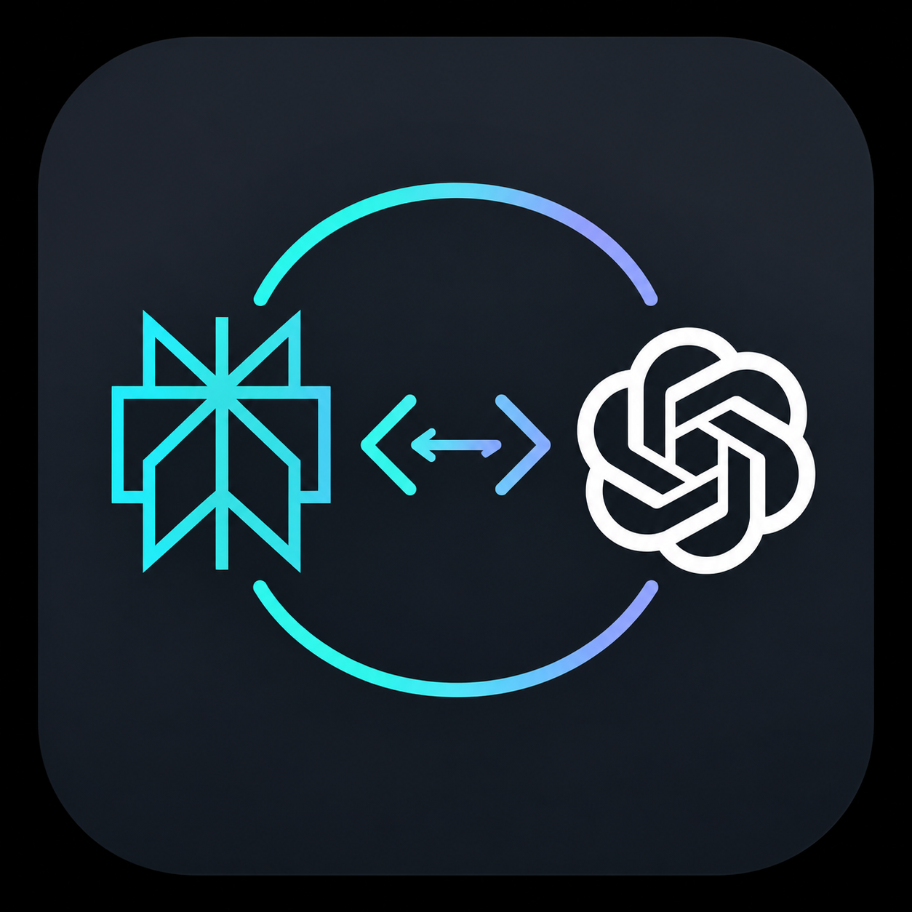

<p align="center">
  
</p>

# Codex–Perplexity Adapter

A local service that lets the Codex CLI, Codex app, and compatible IDE extensions use models exposed by Perplexity's Agent API. It translates the OpenAI Responses API traffic produced by Codex into the format accepted by Perplexity.

Codex cannot connect directly to the Perplexity Agent API because the two services use different request, response, streaming, and tool-call formats. This local adapter translates between those formats; an API key alone is not sufficient.

```text
Codex CLI, app, or IDE extension
        │
        ▼
Local adapter on 127.0.0.1:4000
        │  HTTPS
        ▼
Perplexity Agent API
```

## Download and setup

Download the appropriate macOS app from the [latest release](https://github.com/aportugu/codex-perplexity-adapter/releases/latest):

| Mac | Download |
| --- | --- |
| Apple Silicon (M1 or newer) | [Codex-Perplexity-Adapter-macOS-arm64.zip](https://github.com/aportugu/codex-perplexity-adapter/releases/latest/download/Codex-Perplexity-Adapter-macOS-arm64.zip) |
| Intel | [Codex-Perplexity-Adapter-macOS-x86_64.zip](https://github.com/aportugu/codex-perplexity-adapter/releases/latest/download/Codex-Perplexity-Adapter-macOS-x86_64.zip) |

The apps require macOS 13 or newer. After unzipping, move **Codex Perplexity Adapter.app** to Applications, open it, enter a Perplexity API key, and choose **Start Adapter**. Keep the app open while using Codex.

The apps are ad-hoc signed but not Apple-notarized. On first launch, macOS may require you to right-click the app, choose **Open**, and confirm.

## Configure Codex

Modify `~/.codex/config.toml` to include these settings. Keep any unrelated existing settings:

```toml
model = "gpt-5.6-sol"
model_provider = "perplexity_adapter"
model_reasoning_effort = "medium"

[model_providers.perplexity_adapter]
name = "Perplexity Adapter"
base_url = "http://127.0.0.1:4000/v1"
wire_api = "responses"
experimental_bearer_token = "local-adapter-token"
stream_idle_timeout_ms = 300000
```

Then start Codex using the CLI (`codex`), the Codex app, or a compatible IDE extension. The adapter must remain running while Codex is in use.

## Data handling and governance

- **Data processed:** Requests may contain prompts, instructions, conversation context, tool definitions, tool calls, and tool results supplied by Codex.
- **External destination:** The adapter transforms this data and sends it to the hard-coded Perplexity Agent API endpoint over HTTPS. The adapter itself contains no analytics or telemetry integrations.
- **Credentials:** The Perplexity API key is held in the adapter process, sent only to Perplexity in the upstream authorization header, and is not saved by the application. The local bearer token authenticates communication between Codex and the adapter.
- **Storage and logs:** The adapter has no database and does not persist request or response bodies. Access logging is disabled. The macOS app replaces its operational error log at `~/Library/Logs/Codex Perplexity Adapter.log` each time it starts.
- **Network boundary:** The service is hard-coded to listen only on `127.0.0.1` and cannot be exposed through a command-line host option.
- **Organizational responsibility:** Users should submit only data approved for processing by Perplexity under their organization's policies, agreements, and configured retention controls. This adapter does not alter Perplexity's processing or retention practices.

## License and project status

Released under the [MIT License](LICENSE).

This is an independent, unofficial project. It is not affiliated with, endorsed by, or sponsored by OpenAI or Perplexity. Codex, OpenAI, Perplexity, and related marks belong to their respective owners.
